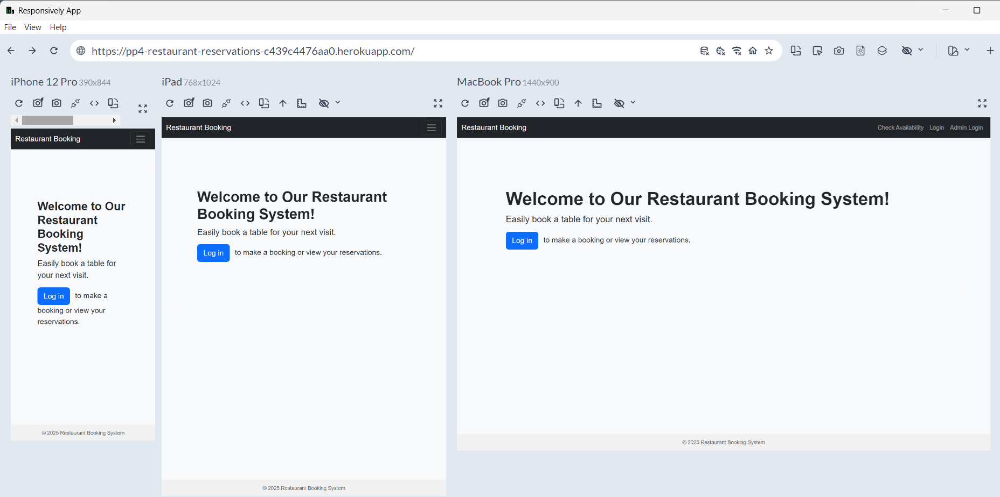
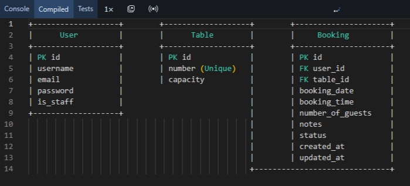
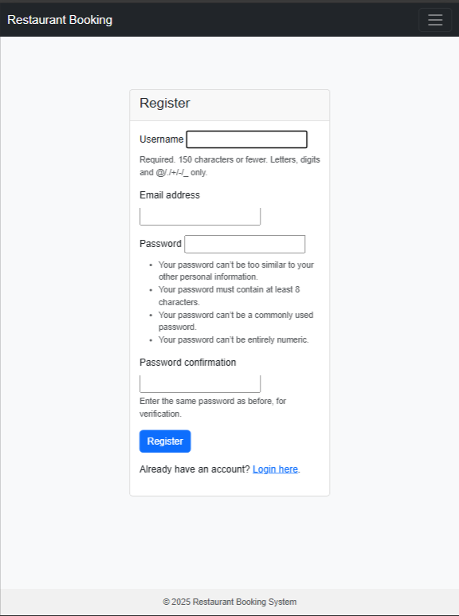
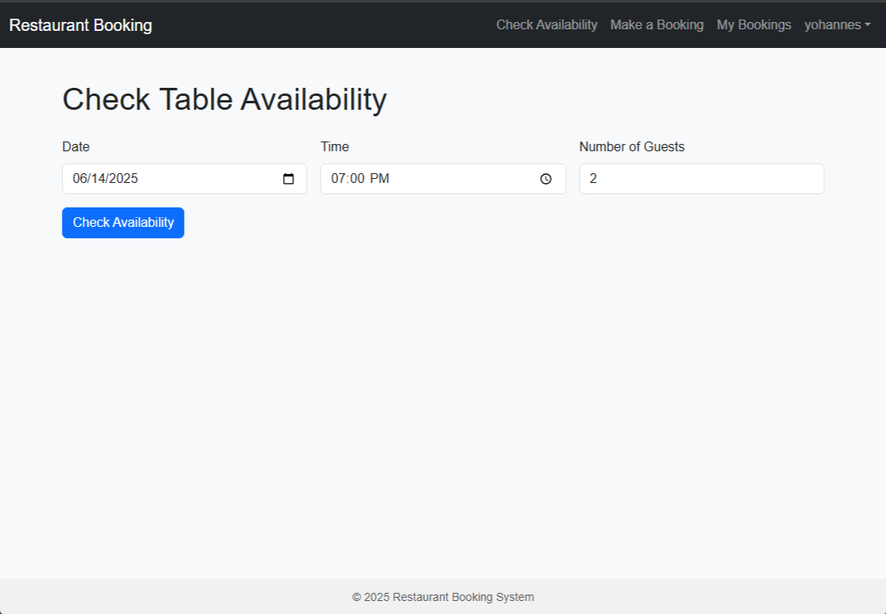
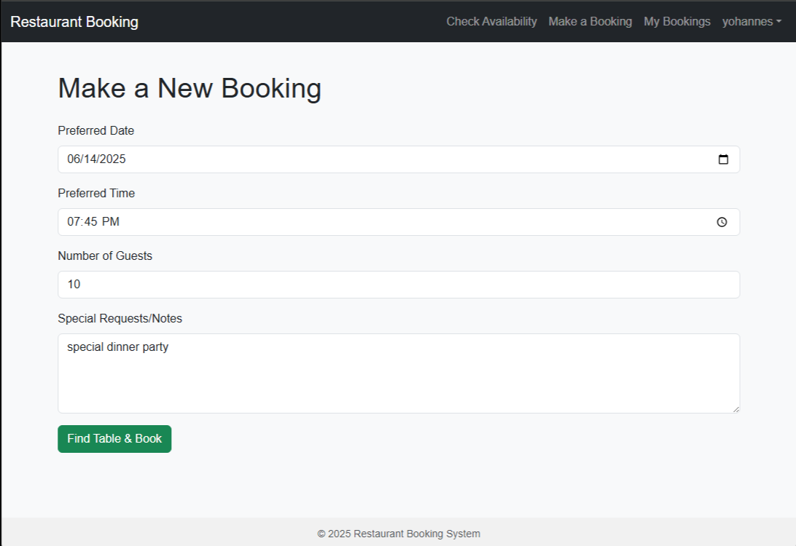
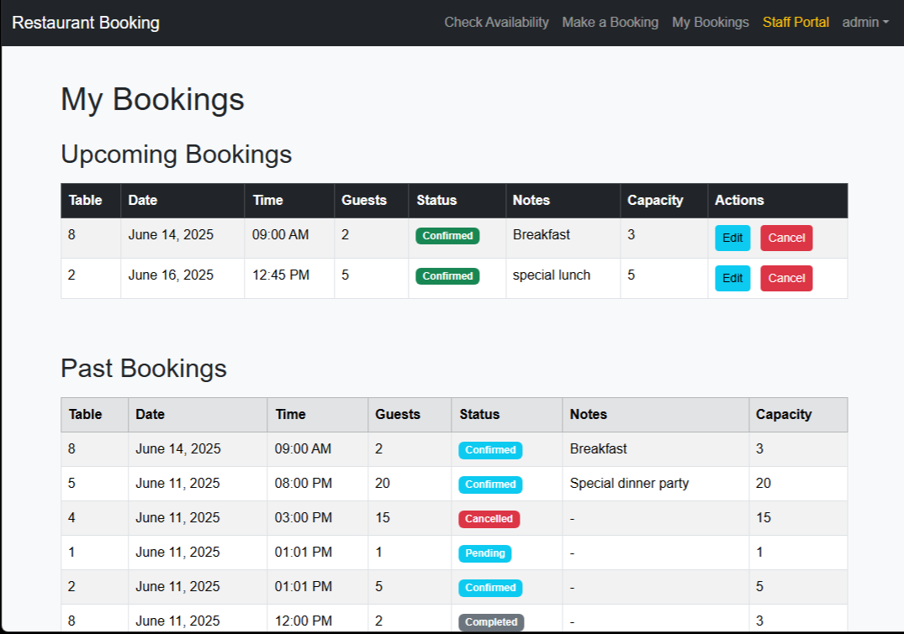
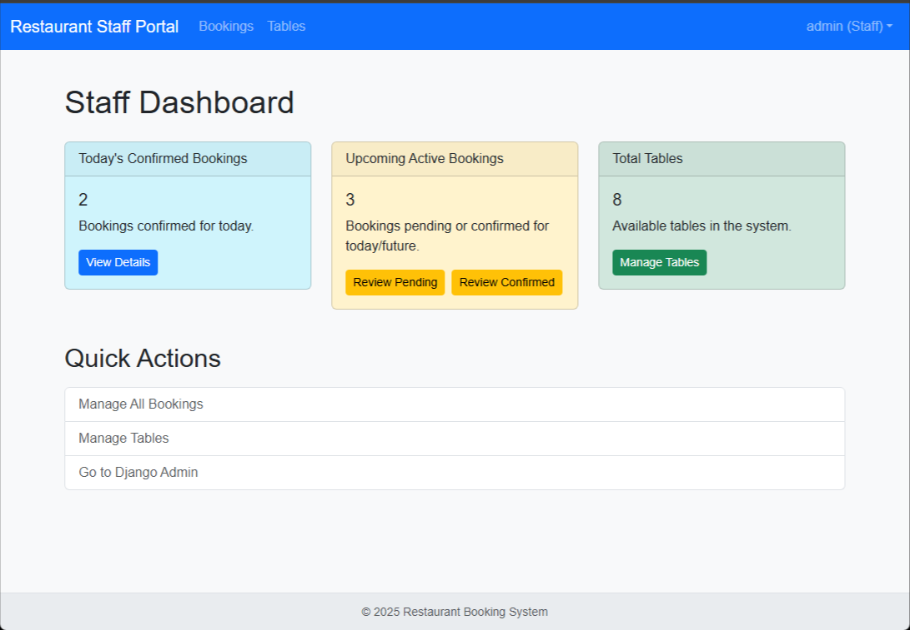
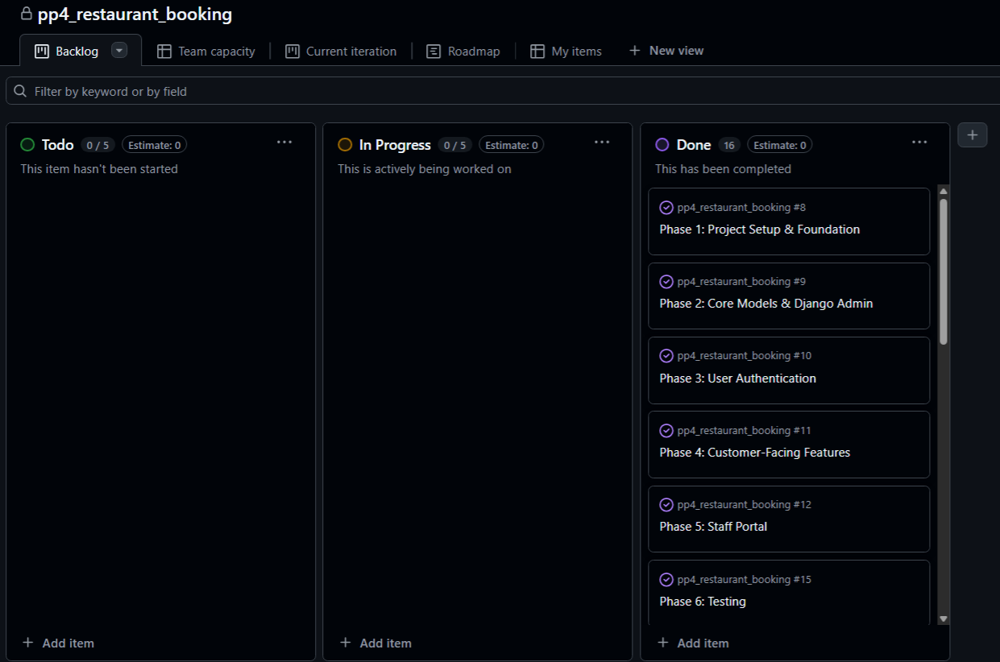

# Restaurant Booking System




## CONTENTS
- [Site Objectives](#site-objectives)
- [User Experience/UX](#user-experience/ux)
  - [User Stories](#user-stories)
- [UX Design](#ux_design)
  - [1. Project Goal](#1_project_design)
  - [2. User Personas](#2._user_personas)
  - [3. Core User Journeys & Flows](#3._core_user_journey)
  - [4. Key Feature UX Considerations](#4.key_feature_ux_considerations)
- [Design Choices](#design-choices)
  - [Colour Scheme](#colour-scheme)
  - [Typography](#typography)
  - [Database Plan](#database_plan)
 - [Features](#features)
  - [For Customers](#for_customers)
    - [User Registration and Authentication](#user_registration_and_authentication)
    - [Check Table Availability](#check_table_availability)
    - [Make a New Booking](#make_a_new_booking)
    - [My Bookings](#my_bookings)
  - [For Restaurant Owners, Managers and Staff Members](#for_restaurant_owners_and_staff_members)
    - [Booking Statistics Cards](#booking_statistics_cards)
    - [Today’s Confirmed Bookings](#today's_confirmed_bookings)
    - [Upcoming Active Bookings](#upcoming_active_bookings)
    - [Total Tables](#total_tables)
    - [Qick Actions Sections](#quick_actions_section)
  - [Future Features](#future-features)
- [Technologies Used](#technologies-used)
    - [Languages](#languages)
    - [Libraries & Packages](#libraries_&_packages)
    - [Tools](#tools)
    - [Agile](#agile)
    - [Frontend Technologies](#frontend_technologies)
    - [Backend Technologies](#backend_technologies)
    - [Development Tools](#development_tools)
- [Frameworks](#frameworks)
- [Agile](#agile)
- [Testing](#testing)
- [Deployment & Local Development](#deployment_&_local_development)
  - [Forking the GitHub Repository](#forking_the_github_repository)
  - [Cloning the GitHub Repository](#cloning_the_github_repository)
  - [Code Institute PostgreSQL Database](#code_institute_postgreSQL_databases)
  - [Deployment](#deployment)
  - [Setting Up](#setting_up)
  - [Heroku Deployment](#heroku_deployment)
- [Credits](#credits)
  - [Code Credits](#code_credits)
- [Acknowledgments and Thanks](#acknowledgments-and-thanks)


## Site Objectives
The Restaurant Booking System aims to provide users with an easy and efficient way to book tables at their favorite restaurant. It eliminates the need for direct phone calls and enables customers to manage their bookings effortlessly online, enhancing overall customer satisfaction.
*   **Simplify the Reservation Process** – Allow customers to book tables online, view available time slots, and receive instant confirmation.
    
*   **Improve Restaurant Management** – Help restaurant staff track reservations, manage peak hours, and minimize overbooking.
    
*   **Enhance Customer Experience** – Provide a user-friendly interface for customers to make, modify, or cancel bookings effortlessly.
    
*   **Optimize Table Utilization** – Ensure better occupancy rates by dynamically managing reservations.
    
*   **Enable Secure and Efficient Communication** – Display automated confirmation , and notifications to both customers and staff.
    
*   **Integrate with Authentication & User Management** – Enable customer login via **Django Allauth** for a personalized experience.

## User Experience/UX

### Target Audience
The target audience for this application includes:
1. **Customers**:
   * **Food Enthusiasts**: Individuals looking to try new dining experiences, cuisines, and venues.
   * **Families**: Parents seeking a convenient way to book tables for family outings.
   * **Corporate Clients**: Professionals needing to arrange business lunches or dinners at restaurants.
   * **Tourists**: Travelers wanting to discover local dining options and make reservations in advance.
   * **Event Planners**: Individuals organizing events such as parties or gatherings requiring specific arrangements.
2. **Restaurant Owners and Managers**:
   * **Small to Medium-Sized Restaurant Owners**: Owners looking for an efficient way to manage bookings and customer interactions.
   * **Restaurant Managers**: Personnel responsible for day-to-day operations and customer service, aimed at improving efficiency.
3. **Staff Members**:
   * **Waitstaff and Hosts**: Employees needing access to booking systems to manage seating arrangements and customer flow.

- Diners looking to book tables in advance.
- Restaurant owners who want to manage bookings more efficiently.
- Users who appreciate a seamless online experience for reservations.


### User Stories

**User Registration and Login**

- **As a user**, I can register and create an account so that I can make bookings.
- **As a user**, I can log in to my account so that I can manage my bookings.

---

**Table Booking & Management**

**For Customers:**

- **As a user**, I can search for available tables based on date and time.
- **As a user**, I can select a table and make a reservation.
- **As a user**, I can view my upcoming and past bookings.
- **As a user**, I can cancel my bookings.

**For Admins:**

- **As an admin**, I can view all bookings.
- **As an admin**, I can manage tables (add, edit, delete).
- **As an admin**, I can confirm or reject bookings.

# UX Design

## 1. Project Goal

To provide a seamless and intuitive online platform for customers to book restaurant tables and for staff to efficiently manage reservations and table resources.

---

## 2. User Personas

### • Persona 1: The Hungry Customer (Primary User)

- **Needs:**
  - Quick and easy booking process
  - Clear availability information
  - Ability to view/manage own bookings
  - Reliable confirmation

- **Behaviors:**
  - Often uses mobile
  - Might check availability spontaneously
  - Values convenience

- **Goals:**
  - Secure a table for a specific date/time
  - Avoid double-bookings
  - Receive confirmation

### • Persona 2: The Efficient Staff Member (Admin/Manager)

- **Needs:**
  - Centralized view of all bookings
  - Quick filters/search
  - Ability to update booking statuses (confirmed, cancelled, completed)
  - Manage table inventory
  - Identify popular times

- **Behaviors:**
  - Uses desktop for daily operations
  - Needs quick access to critical information
  - Requires robust tools

- **Goals:**
  - Maintain accurate booking records
  - Optimize table utilization
  - Respond to customer inquiries about bookings
  - Ensure smooth service flow

---

## 3. Core User Journeys & Flows

### A. Customer Journey: Making a Booking

1. Customer lands on the homepage.
2. Clicks **"Make a Booking"** or **"Check Availability"**.
3. Enters preferred date, time, and number of guests.
4. System shows available tables or displays a message if none are available.
5. If satisfied, customer fills out the booking form: date, time, guests, and optional notes.
6. Form validates input and provides instant feedback on errors.
7. Clicks **"Find Table & Book"**.
8. System finds a suitable table and creates the booking.
9. Displays success message and redirects to **"My Bookings"** page.

### B. Customer Journey: Managing Existing Bookings

1. Customer logs in and navigates to **"My Bookings"**.
2. Views list of **"Upcoming Bookings"** and **"Past Bookings"**.
3. Clicks **"Cancel Booking"** on an upcoming booking.
4. System prompts for confirmation.
5. If confirmed, booking status changes to "Cancelled", and a success message appears.
6. Page refreshes to reflect updated status.

### C. Staff Journey: Daily Booking Management

1. Staff logs into the **Staff Portal**.
2. Sees a dashboard summary of today's confirmed bookings, upcoming bookings, and total tables.
3. Clicks **"Bookings"** in navigation.
4. Views a paginated list of all bookings.
5. Uses filters (status, date) and search (user, table, notes) to find bookings.
6. Clicks **"View/Edit"** on a booking.
7. Views details and edits status or adds staff notes.
8. Changes status (e.g., pending → confirmed) and saves.
9. Receives **"Booking status updated successfully!"** confirmation.

### D. Staff Journey: Table Management

1. Staff logs into the **Staff Portal**.
2. Clicks **"Tables"** in navigation.
3. Views list of all tables.
4. Uses **"Add New Table"** form to input table number and capacity.
5. System validates and saves new table.
6. Edits existing tables using **"Edit"**.
7. Updates table number or capacity.
8. Deletes a table using **"Delete"**.
9. Confirmation dialog appears with warning about associated bookings.
10. Success or error feedback shown.

---

## 4. Key Feature UX Considerations

### • Homepage

- **Hero Section:** Prominent **"Make a Booking"** button.
- **Clarity:** Clear message about the restaurant and how to book.
- **Visual Appeal:** High-quality images, clean layout.

### • Booking Forms (Make & Check Availability)

- **Intuitive Fields:** Date picker, time input, guest selector.
- **Progressive Disclosure:** Optional fields (like notes) hidden by default.
- **Immediate Feedback:** Real-time validation for inputs.
- **Date/Time Constraints:** No past dates; clear messaging for business hours.

### • My Bookings Page

- **Categorization:** Separate "Upcoming" and "Past" bookings.
- **Key Info:** Visible at a glance (date, time, table, guests, status).
- **Status Indicators:** Color-coded badges (green: confirmed, yellow: pending, red: cancelled).
- **Cancellation:** Prominent button with confirmation dialog. Disabled if too close to time or already cancelled.

### • Staff Dashboard

- **At-a-Glance Metrics:** Cards for:
  - Today's Confirmed Bookings
  - Upcoming Active Bookings
  - Total Tables
- **Quick Links:** From cards to filtered booking lists.
- **Navigation:** Sidebar or topbar with links to **Bookings** and **Tables**.

### • Staff Booking List

- **Filtering:** By status (Pending, Confirmed, Cancelled, Completed) and date.
- **Search:** User names, table numbers, notes.
- **Pagination:** For long lists.
- **Action Column:** **"View/Edit"** buttons.

### • Staff Table List

- **Add Form:** Always visible for quick addition.
- **Table Data:** Displayed clearly (number and capacity).
- **Actions:** **"Edit"** and **"Delete"** buttons.
- **Deletion Warning:** Confirmation with warning if bookings exist; graceful error if deletion is blocked.

### • Global Messages

- Use Django's `messages` framework for consistent user feedback (success, error, warning alerts).

### • Responsiveness

- Bootstrap 5 grid system and responsive classes for mobile/tablet/desktop support.

### • Accessibility

- **Semantic HTML:** Use appropriate tags (`<nav>`, `<button>`, `<label>`, `<table>`) for screen readers.
- **Form Labels:** Ensure all inputs are properly labeled.
- **Keyboard Navigation:** All UI elements must be keyboard accessible.
- **Color Contrast:** Ensure high contrast between text and background.


## Design Choices

### Colour Scheme

The chosen color scheme aims to evoke a warm and inviting atmosphere while maintaining clarity and usability.


### Typography

The typography choices focus on readability and aesthetic appeal. The selected fonts are:

- **Font**: Arial, Helvetica, sans-serif, sans-serif - Used for headings and body text for a modern and clean appearance. It improves readability across various devices.

**Font Sizes**:
- Headings: 24px (H1), 20px (H2), 18px (H3)
- Body Text: 16px


### Database Plan

**1. User**

- Based on Django's built-in `User` model.
- Used for both **customers** and **staff** (differentiated via the `is_staff` flag).

---

**2. Table**

**Fields:**
- `id` (Primary Key)
- `number` (Integer, Unique): Table number
- `capacity` (Integer): Seating capacity

**Relationships:**
- **One-to-Many** with `Booking`  
  (A single table can have multiple bookings)

---

**3. Booking**

**Fields:**
- `id` (Primary Key)
- `user` (ForeignKey to `User`): Customer who made the booking
- `table` (ForeignKey to `Table`): Assigned table
- `booking_date` (Date): Date of reservation
- `booking_time` (Time): Time slot of reservation
- `number_of_guests` (Integer)
- `notes` (Text, Optional): Customer notes
- `status` (CharField with choices):  
  - `pending`  
  - `confirmed`  
  - `cancelled`  
  - `completed`
- `created_at` (DateTime): Timestamp when booking was created
- `updated_at` (DateTime): Timestamp when booking was last updated

---

**Database Tables**

| Table Name   | Description               | Key Fields                                                        | Relationships                   |
|--------------|---------------------------|--------------------------------------------------------------------|----------------------------------|
| `auth_user`  | Django’s built-in user table | `id`, `username`, `email`, `password`, `is_staff`, etc.           | PK for users                     |
| `table`      | Restaurant tables          | `id`, `number` (unique), `capacity`                                | PK, linked to `booking` table   |
| `booking`    | Bookings made by users     | `id`, `user_id` (FK), `table_id` (FK), `booking_date`, `booking_time`, `number_of_guests`, `notes`, `status`, `created_at`, `updated_at` | FK to `user` and `table`        |

---
**Visual ERD Diagram (Textual Representation)**


**Additional Considerations**


**Indexes:**
- Indexes on:
  - `booking_date`
  - `booking_time`
  - `status`
- Unique index on `table.number` to prevent duplicates

**Constraints:**
- **Prevent double bookings** by ensuring:
  - Combination of `booking_date`, `booking_time`, and `table` is unique (enforce via application logic or DB constraint)
- **ForeignKey behavior**:
  - Use `on_delete=models.PROTECT` or custom logic to prevent deleting a table that has active bookings


## Features

This document outlines the key features of the Restaurant Booking System, designed to enhance user experience for customers, restaurant owners, and managers.

---

### Key Features

### For Customers

**User Registration and Authentication**  
   - Users can create an account and securely log in to access features tailored to their preferences.  
   - Password recovery options are pending for future enhancement for users who forget their login credentials.  
   

**Check Table Availability**  
   - Users can check for restaurant table availability before they try to book a table.  
   

**Make a New Booking**  
   - Users can check for restaurant table availability before they try to book.  
   

**My Bookings**  
   - Users can easily see tables for their upcoming and past bookings.  
   

### For Restaurant Owners, Managers and Staff Members



***Page Title***

Sets the page title to **"Staff Dashboard"**.

---

***Booking Statistics Cards***

The dashboard displays three summary cards with real-time data:

***day's Confirmed Bookings***
- Shows the count of all bookings that are **confirmed for the current day**.
- Includes a quick link to view those bookings filtered by today’s date and status.

***Upcoming Active Bookings***
- Displays the total number of bookings that are either **pending or confirmed**, and scheduled for today or a future date.
- Provides buttons to **filter and review** pending or confirmed bookings separately.

***Total Tables***
- Indicates the **total number of tables** currently available in the system.
- Includes a link to the **table management** page.


---
***Qick Actions Sections***

Offers convenient links for commonly performed staff tasks:

- **Manage All Bookings** – redirects to the full booking list view.
- **Manage Tables** – opens the table management interface.
- **Go to Django Admin** – provides a direct link to the Django admin panel (opens in a new tab).

## Future Features

To enhance the user experience and improve the overall functionality of the restaurant booking system, several features are planned for future development:

#### 1. Email and PDF Booking Confirmations
Customers will receive an automatic **email confirmation** immediately after making a reservation. This confirmation will include all the booking details (date, time, table number, number of guests, and any special notes).  
Additionally, a **PDF version** of the confirmation** will be attached or made available for download. This provides a printable summary for customers who prefer physical copies or need documentation for events or business purposes.

#### 2. Table Reservation Pricing and Descriptions
To offer greater transparency, each table will display its **pricing details** (if applicable). For example, premium tables (e.g., window seating or private booths) may carry a small fee, while standard tables remain free.  
This feature will also include **short descriptions** of each table’s location, capacity, and atmosphere (e.g., “near window,” “quiet corner,” or “ideal for small groups”), helping users make more informed choices during the reservation process.

#### 3. Restaurant Information Page
A dedicated page will be added to provide comprehensive **information about the restaurant**, including:

- Opening hours and holiday schedules  
- Menu overview or downloadable menu  
- Restaurant address with Google Maps integration  
- Contact information (phone, email, social media links)  
- Photos of the venue and dining area  
- Brief history or story of the restaurant  

This feature aims to give potential customers better context and confidence before making a booking.


# Technologies Used


## Languages

- [HTML5](https://en.wikipedia.org/wiki/HTML5)
- [CSS3](https://en.wikipedia.org/wiki/CSS)
- [JavaScript](https://en.wikipedia.org/wiki/JavaScript)
- [Python](https://en.wikipedia.org/wiki/Python_(programming_language))


## Libraries & Packages
  
- [Django 4.2.21](https://docs.djangoproject.com/en/4.2/) - The main web framework used to build the application, creating models, views and templates.
- [Bootstrap 5](https://getbootstrap.com/) - front-end CSS framework for modern responsiveness and pre-built components
- [Google Fonts](https://fonts.google.com/) - fonts used on the app
- [django-crispy-forms](https://django-crispy-forms.readthedocs.io/en/latest/) - enhanced form rendering with customizable styles and better integration with Bootstrap
- [cripsy-bootstrap5](https://github.com/django-crispy-forms/crispy-bootstrap5) - Bootstrap 5 styling support to `django-crispy-forms`
- [django-allauth](https://django-allauth.readthedocs.io/en/latest/) - user authentication, registration, and account management
- [Gunicorn](https://gunicorn.org/) - used for WSGI server
- [psycopg2](https://pypi.org/project/psycopg2/) - PostgreSQL adapter for Python, used to interact with the PostgreSQL database
- [whitenoise (5.3.0)](https://whitenoise.readthedocs.io/en/latest/) - serving static files in production


## Tools

- [Git](https://git-scm.com/) - version control
- [GitHub](https://github.com/) - save and store the files for the app
- [GitPod](https://gitpod.io/) - developing the app
- [Heroku](https://heroku.com/) - deploying the app
- [PostgreSQL](https://www.postgresql.org/) - database
- [Balsamiq](https://balsamiq.com/) - wireframes
- [Am I Responsive](https://ui.dev/amiresponsive) -responsive screenshots
- [favicon.io](https://favicon.io/) - custom favicon
- [ChatGPT](https://chatgpt.com/) - AI assisstant for explanation
- [The W3C Markup Validation Service](https://validator.w3.org/) - validating HTML
- [The W3C CSS Validation Service](https://jigsaw.w3.org/css-validator/) - validating CSS
- [Code Insitute PEP8 Validator](https://pep8ci.herokuapp.com/#) - validating the Python code
- [JSHint](https://jshint.com/) - validating JavaScript
- [Chrome DevTools](https://developer.chrome.com/docs/devtools/) - during development to log the errors to console.
- [Django Secret Key Generator](https://djecrety.ir/) - generating a secret key


This document lists the technologies, frameworks, programming languages, and tools utilized in the development of the Restaurant Booking System.

---
## Agile

Agile methodologies were employed throughout development, with an emphasis on iterative progress, continuous feedback, and adaptability to change.

---

## Frontend Technologies

1. **HTML5**:
   - Used for structuring the content of the web application, ensuring semantic and accessible markup.

2. **CSS3**:
   - Utilized for styling the user interface, implementing responsive design practices, and managing layout to enhance user experience.

3. **Bootstrap** :
   - A front-end framework used for developing responsive and mobile-first websites quickly and efficiently.

---

## Backend Technologies

1. **Django**:
   - Django is a high-level Python web framework that simplifies the development of secure, scalable, and maintainable web applications. It follows the Model-View-Template (MVT) architecture and comes with built-in features that help developers build web applications quickly and efficiently.

4. **Database Management System**:
   - **PstgreSQL** 
     - PostgreSQL (often called Postgres) is a powerful, open-source, object-relational database system (ORDBMS) known for its reliability, extensibility, and performance. It is widely used in web applications, data analytics, and large-scale enterprise solutions..

---

## Development Tools

1. **Version Control**:
   - **Git**: 
     - Used for source code management, allowing developers to track changes, collaborate, and manage different versions of the codebase.
   - **GitHub**: 
     - Used for hosting the repository, facilitating collaboration, code reviews, and issue tracking.

2. **Development Environment**:
   - **Visual Studio Code** (or other code editors):
     - A lightweight, powerful code editor with integrated debugging, syntax highlighting, and extensions to enhance productivity.

---

# Testing

Testing notes for the Restaturant Booking Reservation System Project are contained in a separate[TESTING.md](TESTING.md) file.


#  Deployment & Local Development    

  
### Forking the GitHub Repository

  A copy of the original repository can be made through GitHub. Please follow the  steps below  to fork this repository.


  1. Navigate to GitHub and log in.  
  2. Once logged in, navigate to this repository using this link [My Restaurant Booking Repository](https://github.com/yohannes2025/pp4_restaurant_booking).
  3. Click the "Fork" button at the top right corner of the repository page.
  4. Choose where you want to fork the repository (your GitHub account or an organisation you belong to).
  5. You should now have access to a forked copy of this repository in your Github account.

  -----

### Cloning the GitHub Repository

  A local clone of this repository can be made on GitHub. Please follow the below steps.
  1. Navigate to GitHub and log in.
  2. The [My Restaurant Booking Repository](https://github.com/yohannes2025/pp4_restaurant_booking) can be found at this location.
  3. Above the repository file section, locate the '**Code**' button.
  4. Click on this button and choose your clone method from HTTPS, SSH or GitHub CLI, copy the URL to your clipboard by clicking the '**Copy**' button.
  5. Open your Git Bash Terminal.
  6. Change the current working directory to the location you want the cloned directory to be made.
  7. Type `git clone` and paste in the copied URL from step 4.
  8. Press '**Enter**' for the local clone to be created.

  For more details about forking and cloning a repository, please refer to [GitHub documentation](https://docs.github.com/en/get-started/quickstart/fork-a-repo).

---

### Code Institute PostgreSQL Database

1. Create an [Code Institute PostgreSQL](https://dbs.ci-dbs.net/manage/) account.
2. Create a new instance.
3. Copy the database URL.
4. Add database to the settings.py-file in Django.


- Add to **env.py** and link up with **settings.py**: ```os.environ["CLOUDINARY_URL"]="cloudinary://...."``` 
- Set Cloudinary as storage for media and static files in settings.py:
- ```STATIC_URL = '/static/'```
```
  STATICFILES_STORAGE = 'cloudinary_storage.storage.StaticHashedCloudinaryStorage'  
  STATICFILES_DIRS = [os.path.join(BASE_DIR, 'static'), ]  
  STATIC_ROOT = os.path.join(BASE_DIR, 'staticfiles')‌  
  MEDIA_URL = '/media/'  
  DEFAULT_FILE_STORAGE = 'cloudinary_storage.storage.MediaCloudinaryStorage'
```

# Deployment

The Restaurant Booking System web app is deployed via GitHub and Heroku.

The deployed  web app is: [Restaurant Booking System](https://pp4-restaurant-reservations-c439c4476aa0.herokuapp.com/)

The GitHub Repository containing the code is at: [https://github.com/yohannes2025/pp4_restaurant_booking](https://github.com/yohannes2025/pp4_restaurant_booking)


## Setting Up

To set up this project, I installed the necessary libraries and deployed the project to Heroku earlier to ensure the project was working. 

The steps are: 

1. Install Django and necessary libraries and create a Django Project and App.
2. Configure the project to use Cloudinary and PostgreSQL.
3. Deploy to Heroku


### Set up Details

- Install Django and Create a Project and App
    
    In the terminal, type the following commands to install a recommended version of Django and the necessary libraries:
    
    ```python
    **pip3 install 'django<4' gunicorn
    
    pip3 install dj_database_url==0.5.0 psycopg2**
    ```
    
    The images for this project will be hosted by Cloudinary. That requires some libraries to be installed. For that we use the following commands: 
    
    ```bash
    pip3 install dj3-cloudinary-storage
    pip3 install urllib3==1.26.15
    ```
    
    At this stage we can create the requirements.txt file, with the command: 
    
    ```bash
    pip3 freeze --local > requirements.txt
    ```
    
    Create a new Django project and app:
    
    ```bash
    django-admin startproject pp4_restaurant_booking .
    python3 manage.py startapp bookings
    ```
    
    In the “pp4_restaurant_booking” folder, edit the settings.py to include the new app “bookings”. It is also necessary to update the filed ALLOWED_HOSTS. 
    
    The changes now need to be migrated to the data base: `python3 manage.py makemigrations` and `python3 manage.py migrate`
    
    To run the server simply type on the terminal `python3 manage.py runserver`
    
- Configure Cloudinary, PostgresSQL and Heroku
    
    **Cloudinary**
    
    Login to [Cloudinary.com](http://Cloudinary.com) and go to Dashboard. There, copy the **API Environment variable** (CLOUDINARY_URL) and the API Secret Key. 
    
    **PostgreSQL**
    
    In the [ElephantSQL](https://www.elephantsql.com/) dashboard, select: “Create New Instance” and follow the steps.  
    
    Then copy the PostgreSQL URL, create a env.py and add the copied URL
    
    **env.py and Secret Key**
    
    Create an env.py file, and set it up as the code below. Using the URLs mentioned above and a a “Secret Key” you will create. Below there's a sample how the env.py should look like:
    
    ```bash
    import os
    os.environ["DATABASE_URL"] = "postgres://DATA-BASE-URL"
    os.environ["SECRET_KEY"] = "CREATE-YOUR-OWN-KEY"
    os.environ["CLOUDINARY_URL"] = "cloudinary://COUDINARY-ADDRESS"
    ```
    
    This the same  SECRET_KEY is necessary to update settings.py and Heroku.
    
    In the settings.py created by Django, import the env.py file and the Secret key. 
    
    ```bash
    from pathlib import Path
    import os
    import dj_database_url
    
    if os.path.isfile("env.py"):
        import env
    ```
    
    ```bash
    SECRET_KEY = 'CREATE-YOUR-OWN-KEY'
    ```
    


## Heroku Deployment

To deploy the site to Heroku, follow these steps:

1. **Create a Heroku Account.**
2. **Create a New App:**
Once you are logged in, click the "New" button located in the top-right corner of the Heroku dashboard. Then, select "Create new app" from the options provided.
3. **Name Your App:**
Enter a unique and meaningful name for your app.
4. **Choose Region and Create App:**
Select a region that is geographically closer to your target audience. After choosing the region, click "Create app" to set up your new app.
5. **Add Heroku Postgres:**
In the Heroku dashboard, navigate to the "Resources" tab. Search for "Heroku Postgres" and choose the "hobby dev" plan. Click "Continue" to provide the database.
6. **Configure Environment Variables:**
Go to the "Settings" tab, then click "Reveal Config Vars." Here, add the following environment variables:
    - **`SECRET_KEY`**: The same Secret Key in the project's env.py.
    - **`DATABASE_URL`**: The PostgreSQL URL of the instance created for this project.
    - **`CLOUDINARY_URL`**: The URL for your Cloudinary API.
7. **Deployment from GitHub:**
In the Heroku dashboard, go to the "Deploy" tab. Scroll down to "Connect to GitHub" and sign in/authorise your GitHub account when prompted. Then, search for the repository you want to deploy and click "Connect."
8. **Manual Deployment:**
After connecting your repository, scroll down to the "Manual deploy" section. Choose the "main" branch (or any other appropriate branch) and click "Deploy" to initiate the deployment process.
Full details for deploying to Heroku using Git can be found [here](https://devcenter.heroku.com/articles/git).
-----

# Credits
---

### Code Credits
  
| Source | Notes |
| --- | --- | 
|[Code Institute I Think Therefore I Blog walkthrough](https://learn.codeinstitute.net/ci_program/spadvfe2024_9) |An outstanding Django project prototype that greatly influenced the structure of my project.|
|[Markdown Live Preview](https://markdownlivepreview.com/) | Online Markdown Editor - Dillinger, the Last Markdown Editor ...|
[Django Web Framework (Python)](https://developer.mozilla.org/en-US/docs/Learn_web_development/Extensions/Server-side/Django/Testing)|Django Tutorial Part 10: Testing a Django web application|
|[Django Reservation System](https://stackoverflow.com/questions/54932056/django-reservation-system8) |web-based reservation system, for example, for a restaurant |
|[CI Python Linter](https://pep8ci.herokuapp.com/) | Code Institute Python Linter |
|[Django Tutorial](https://www.w3schools.com/django/index.php)|Step by step guide on how to install and create a Django project |
|[Merge images online](https://pinetools.com/merge-images)|Merging home page images for mobile, tablet and computer views|
|[Django 5 By Example](https://github.com/PacktPublishing/Django-5-By-Example?tab=readme-ov-file)|Build powerful and reliable Python web applications from scratch|
    
# Acknowledgments and Thanks

  * My mentor, Jubril Akolade, for his valuable guidance and clear explanations of the assessment criteria throughout each project.
  * I extend my heartfelt gratitude to the entire Code Institute Student Care Team for their dedication and support in helping me overcome every challenge I encountered throughout the project.
  * I sincerely thank my friends and family for testing the project on their devices and providing valuable, constructive feedback that helped improve its functionality and user experience.
  * I thank God for everything—His unwavering guidance, endless grace, and the strength He provides each day. In moments of joy and in times of challenge, His presence remains my greatest blessing. For every breath, every opportunity, and every lesson, I am truly grateful.
