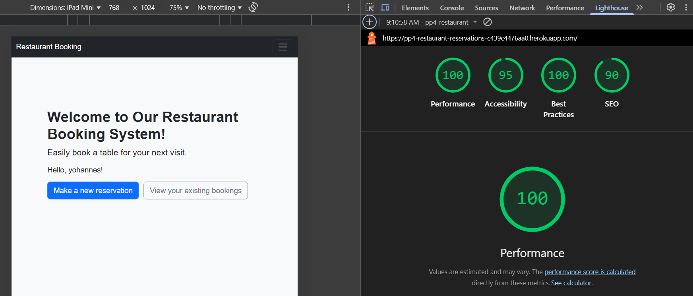

- [Testing](#testing)
  * [Manual Testing](#manual-testing)
  * [Validator Testing](#validator-testing)
    + [w3 HTML Validator](#w3-html-validator)
    + [CSS Validation](#css-validation)
    + [Python Validation (PEP8)](#python-validation-pep8)
  * [Lighthouse](#lighthouse)
  * [Error and Bugs](#error-and-bugs)

# Testing

## Manual Testing

### User Authentication

| Test Description                                                                     | Result |
|--------------------------------------------------------------------------------------|--------|
| User can register on the website                                                    | ✅ Pass |
| User can log in after registration                                                  | ✅ Pass |
| User can log out successfully                                                       | ✅ Pass |
| User cannot access or manage bookings after logging out                             | ✅ Pass |

### Booking Functionality

| Test Description                                                                 | Result |
|----------------------------------------------------------------------------------|--------|
| A new booking can be created successfully                                       | ✅ Pass |
| An existing booking can be edited/updated                                       | ✅ Pass |
| Prevent booking a table for a date in the past                                  | ✅ Pass |
| Booking can be deleted (soft delete or status changed to 'cancelled')          | ✅ Pass |
| Booking form cannot be submitted when required fields are empty                | ✅ Pass |

### Navigation and Responsiveness

Navigation links were tested on both desktop and mobile devices. Each link was clicked manually to ensure it redirected to the correct page. Navigation followed the design flow and worked consistently across different screen sizes.

**Result:** ✅ Pass

> 💡 All main user-facing functionalities — including registration, login/logout, booking management, and navigation — were tested manually. The site responded well across various devices and screen resolutions, confirming its responsiveness and functionality.

---

## Validator Testing

### HTML Validation (W3C)

- All HTML pages were tested using the [W3C HTML Validator](https://validator.w3.org/).
- Minor initial errors (mostly related to templating or missing attributes) were fixed.
- Final test results showed **no critical errors** across all key pages.

> ⚠️ *Note:* Due to Django’s templating system, direct HTML validation was not possible in some cases. Therefore, deployed URLs were used for validation.

###  CSS Validation (W3C)

- The project’s CSS passed validation using the [W3C Jigsaw CSS Validator](https://jigsaw.w3.org/css-validator/).
- No major errors or warnings were present after final review.

### Python Code Validation (PEP8)

- All Python files were validated using **PEP8** guidelines and the **Flake8** linter.
- I ran Flake8 throughout the codebase and ensured it passed without any errors or warnings.
- All reported style and formatting issues (e.g., line length, indentation, spacing) were resolved.
- > *The Python code is clean, readable, and fully compliant with PEP8 standards.*

---

## Summary

Manual and validator testing confirmed that the restaurant booking system:
- Performs all key user actions reliably.
- Maintains responsive layout and proper navigation across devices.
- Adheres to web and code standards.

These results indicate a high level of reliability and code quality for the live deployment of the project.

>

## Lighthouse Test Summary

The Lighthouse audit for the **Restaurant Booking Application** delivered impressive results across all categories:

### Performance: **100**
- The application performs exceptionally well, with:
  - Fast load times
  - Optimized images
  - Efficient use of resources
  - Lazy loading and minimized scripts

### Accessibility: **95**
- Strong accessibility support, including:
  - Clear visual hierarchy
  - Appropriate color contrast
  - Keyboard navigation support
  - Descriptive alt text for images
- A few minor enhancements (e.g., ARIA attributes) can help reach 100.

### Best Practices: **100**
- Follows modern web development standards:
  - Secure connections (HTTPS)
  - No vulnerable libraries
  - Proper use of web technologies
  - Mobile-friendly design

### SEO: **90**
- Well-structured and search engine friendly:
  - Meta tags and descriptions in place
  - Clean URLs
  - Fast and responsive layout
- Can be improved further with additional metadata and schema markup.

---

## Conclusion

The Lighthouse results show the app is fast, reliable, and accessible. With slight improvements in accessibility and SEO, it has the potential to score 100 across all metrics.

## Errors and Bugs Encountered During Development

During the development of the Restaurant Booking Reservation system, several issues were identified and addressed. Below is a summary of the key bugs and how they were resolved:

### 1. Booking in the Past Allowed
**Issue:** Initially, users were able to create bookings for past dates and times.  
**Cause:** Lack of validation in the booking form for date and time comparison.  
**Fix:** Custom form validation was added to prevent past dates and times from being accepted.

---

### 2. Double Booking on the Same Table and Time
**Issue:** Users could book the same table at the same time as another reservation.  
**Cause:** Missing uniqueness check in table availability logic.  
**Fix:** Logic was added to filter out already-booked tables based on date and time before presenting options to the user.

---

### 3. Navigation Issues on Mobile Devices
**Issue:** Navigation bar did not collapse correctly on smaller screen sizes.  
**Cause:** Bootstrap navbar toggle button was misconfigured.  
**Fix:** Updated the Bootstrap classes and ensured JavaScript functionality was enabled for responsive navigation.

---

### 4. Cancel Booking Too Close to Time
**Issue:** Users were able to cancel bookings too close to the reservation time.  
**Cause:** There was no time threshold to restrict last-minute cancellations.  
**Fix:** A rule was implemented to block cancellations within 2 hours of the booking time, with appropriate error messaging.

---

### 5. Access to Bookings After Logout
**Issue:** In rare cases, users could still access certain booking pages after logging out.  
**Cause:** Missing login-required decorators on some views.  
**Fix:** All views that require authentication were secured with `@login_required`.

---

### 6. Form Submission Without Required Fields
**Issue:** Some forms could be submitted with missing required fields, causing server errors.  
**Cause:** The HTML `required` attribute was not consistently applied.  
**Fix:** Required fields were enforced both in the frontend and backend forms.

---

### 7. Booking Confirmation Not Displayed
**Issue:** After submitting a booking, the user wasn’t always seeing a confirmation message.  
**Cause:** The Django messages framework was not used correctly in all cases.  
**Fix:** Added proper success messages using `messages.success()` in all relevant views.

---

### 8. Inconsistent Flash Message Styles
**Issue:** Success and error messages were not visually consistent across the site.  
**Cause:** Missing or incorrect Bootstrap alert classes.  
**Fix:** Unified alert formatting using Bootstrap classes like `alert-success` and `alert-danger`.

---

### 9. Validation Warnings from Linting Tools
**Issue:** The Python code initially had multiple PEP8 violations including:
- Line too long (`E501`)
- Improper indentation (`E128`)
- Missing or excessive blank lines (`E302`, `E305`)  
**Fix:** Ran `flake8`, corrected all style violations, and ensured clean linter output.

---

### Outcome
All identified bugs were successfully resolved through testing, code review, and validation. The final application behaves as expected across both desktop and mobile platforms, with clean code and strong user validation.

# Automated Testing

This project uses a comprehensive suite of automated tests to ensure the reliability, functionality, and robustness of the application. Automated testing is a crucial part of our development process, helping us catch bugs early, prevent new features from breaking existing ones, and ensure everything works as expected.

All tests are built upon Django's `TestCase` class. This provides a dedicated, isolated test database for each test run and a client for simulating web requests, making our tests efficient and reliable.

---

## How to Run Tests

To execute the entire test suite, open your terminal, navigate to your project's root directory (where `manage.py` lives), and run:
python manage.py test

This command will automatically discover and run all tests within your Django applications.

  

Test Categories and Coverage

----------------------------

  

Our automated tests are organized into distinct categories, each focusing on different layers of the application:

  

### 1\. Model Tests (bookings/tests/test\_models.py)

  

These tests verify the core business logic and data integrity rules defined in our Django models: Table and Booking. They ensure:

  

*  **Object Creation:** Table and Booking instances are created correctly with all their attributes.

* test\_create\_table: Confirms a Table object can be successfully made.

* test\_create\_booking: Validates the successful creation of a Booking object with all expected fields.

*  **Unique Constraints:** Database-level uniqueness rules are enforced.

* test\_unique\_table\_number: Ensures no two tables can have the same number.

* test\_unique\_together\_constraint: Prevents a single table from being double-booked for the exact same date and time.

*  **Data Validation:** Model-level validations behave as expected.

* test\_table\_capacity\_validation: Checks if a Table can have a negative capacity (highlighting if this behavior is allowed or a bug).

* test\_booking\_status\_choices: Confirms the Booking status field uses only predefined options.

*  **Referential Integrity (on\_delete behavior):** How related objects interact when a parent object is deleted.

* test\_table\_on\_delete\_protect: Prevents a Table from being deleted if it has associated Booking records.

* test\_user\_on\_delete\_cascade: Ensures all Booking records linked to a User are deleted when that User account is removed.

  

### 2\. View Tests (bookings/tests/test\_views.py)

  

These tests focus on the interaction between the user interface and the backend by simulating HTTP requests and checking responses. They cover:

  

*  **Public Views:**

* test\_home\_view: Checks if the homepage renders correctly.

* test\_register\_view\_GET: Confirms the registration form displays properly on a GET request.

* test\_register\_view\_POST\_success: Validates successful user registration, redirection, and automatic login.

* test\_register\_view\_POST\_failure: Tests scenarios where registration fails, ensuring correct error messages.

*  **Authenticated Views:**

* test\_make\_booking\_GET\_authenticated: Confirms the booking form loads for logged-in users.

* test\_make\_booking\_GET\_unauthenticated: Ensures unauthorized users are redirected to login.

* test\_make\_booking\_POST\_success: Tests successful submission of a new booking.

* test\_make\_booking\_POST\_past\_date\_time: Verifies the system rejects bookings for past dates/times.

* test\_make\_booking\_POST\_no\_tables\_available: Checks for no available tables scenario.

* test\_my\_bookings\_view\_display: Ensures users see their own bookings.

* test\_edit\_booking\_GET: Tests access to editing own bookings.

* test\_edit\_booking\_GET\_unauthorized: Ensures users can't access others' bookings.

* test\_edit\_booking\_POST\_success: Validates booking updates.

* test\_cancel\_booking\_POST\_success: Tests canceling a booking.

* test\_cancel\_booking\_POST\_too\_close\_to\_time: Prevents cancellations close to booking time.

* test\_check\_availability\_GET: Checks availability form loads.

* test\_check\_availability\_POST\_found\_tables: Finds available tables based on criteria.

* test\_check\_availability\_POST\_no\_tables\_found: Handles no tables found.

* test\_check\_availability\_POST\_invalid\_form: Validates input data correctness.

  

### 3\. Form Tests (bookings/tests/test\_forms.py)

  

These tests validate the behavior and validation logic of Django forms:

  

*  **CustomUserCreationForm:**

* test\_valid\_form: User can be created with valid data.

* test\_password\_mismatch: Rejects non-matching passwords.

* test\_duplicate\_username: Prevents duplicate usernames.

*  **BookingForm:**

* test\_booking\_form\_past\_date\_time: Rejects past date/time bookings.

* test\_booking\_form\_time\_out\_of\_range: Enforces restaurant hours (e.g., 9:00 AM - 10:00 PM).

* test\_booking\_form\_zero\_guests: Prevents zero guests.

*  **AvailabilityForm:**

* test\_valid\_availability\_form\_data: Processes valid availability check data.

* test\_availability\_form\_past\_date\_time: Rejects past date/time for availability.

* test\_availability\_form\_time\_out\_of\_range: Enforces operating hours for availability.
